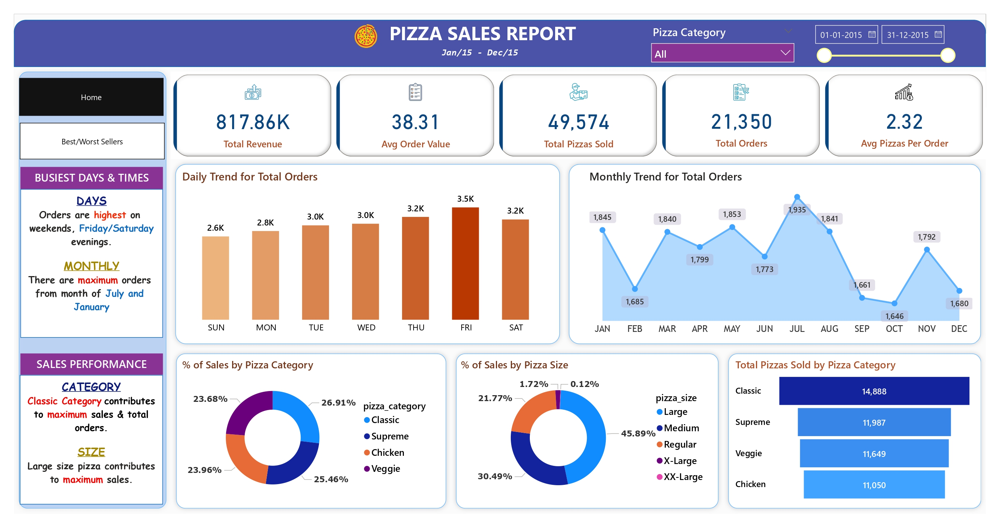

# Pizza-Sales-Dashboard
# 🍕 Pizza Sales Dashboard – Power BI  

## 🚀 Overview  
This project presents an **interactive Pizza Sales Dashboard** built in **Power BI**, using data sourced via **SQL queries**.  
The dashboard provides key business insights into:  
- **Revenue, Orders & Pizzas Sold**  
- **Best & Worst Selling Pizzas**  
- **Sales by Category & Size**  
- **Customer Order Trends (Daily & Monthly)**  
- **Average Order Value & Pizzas per Order**  

The goal is to enable **data-driven decision making** for optimizing menu offerings, tracking performance, and improving sales strategy.  

---

## ✨ Features & Highlights  
- 📊 **Overview Dashboard**  
  - KPIs: Total Revenue, Average Order Value, Total Pizzas Sold, Total Orders, Avg Pizzas per Order  
  - Daily & Monthly Sales Trends  
  - Sales % by Category & Size  
  - Total Pizzas Sold by Pizza Category  

- 🍽️ **Best/Worst Sellers Dashboard**  
  - Top 5 & Bottom 5 Pizzas by Revenue  
  - Top 5 & Bottom 5 Pizzas by Quantity & Orders  
  - Highlights Best & Worst Performers across multiple dimensions  

- 📈 **Business Insights**  
  - Orders are **highest on weekends (Friday/Saturday evenings)**  
  - **July & January** show maximum order volumes  
  - **Classic Pizzas** contribute the most to total revenue and orders  
  - **Large Pizzas** account for ~46% of total sales  
  - **Thai Chicken Pizza** generates maximum revenue  
  - **Brie Carre Pizza** is the lowest performer across revenue, orders, and quantity  

---

## 💡 Impact  
- Helped identify **busiest times & months** to optimize staffing and inventory  
- Insights into **top-performing categories & sizes** guided promotional strategies  
- Highlighted **low-performing pizzas** for menu optimization  
- Provided executives a **centralized dashboard** to track KPIs in real time  

---

## 📂 Project Structure  
- 📊 Pizza Sales Dashboard.pbit → Power BI template
- 🗄️ SQLQuery1.sql → SQL script to extract & preprocess data
- 🖼️ Home.jpg → Dashboard (Overview page screenshot)
- 🖼️ Best or Worst sellers.jpg → Dashboard (Best/Worst Sellers page screenshot)
- 📝 README.md → Project documentation

---

## 🛠 Tools & Technologies  
- **SQL Server** – Data extraction & preprocessing  
- **Power BI Desktop** – Data modeling & dashboard visualization  
- **DAX** – KPI & measure calculations  
- **GitHub** – Version control & documentation  

---

## 📷 Dashboard Preview  

### 🔹 Overview Page  
  

### 🔹 Best/Worst Sellers Page  
  

---

## 🔑 Key Insights  
- **Revenue:** $817.86K total  
- **Total Pizzas Sold:** 49,574  
- **Total Orders:** 21,350  
- **Avg Order Value:** $38.31  
- **Avg Pizzas per Order:** 2.32  
- **Top Pizza by Revenue:** Thai Chicken Pizza  
- **Lowest Performing Pizza:** Brie Carre Pizza  
- **Category Insights:** Classic Pizza contributes maximum sales  
- **Size Insights:** Large Pizza dominates sales (~45.89%)  

---

## 🙌 Author  
**Abhishek Dabhade**  
-📧 (dabhadeabhishek21@gmail.com)
-🔗 [LinkedIn](http://www.linkedin.com/in/abhishek-dabhade-b94336204) 

